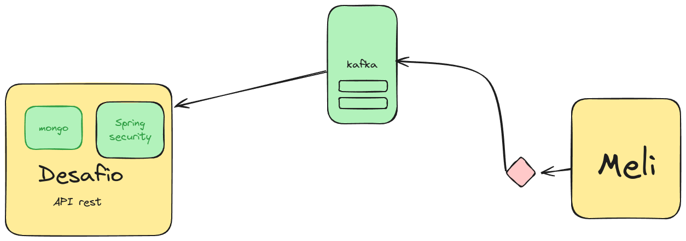
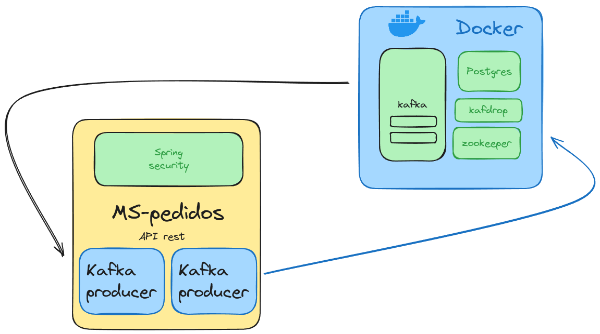
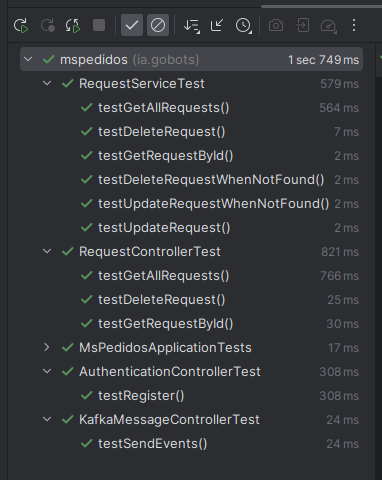

Microsserviço ms-pedidos

Fiz o desafio resumido, colocando o consumidor e o produtor na mesma aplicação, rodando o kafka no docker junto com o banco de dados, zookeeper, e kafkadrop.

Obs: Minha máquina deu uns conflitos com outros containers do mongo em execução com N8N e não podia parar ele, como o tempo estava pouco fiz com o postgres para não perder muito tempo em resolver o problema.

Desenho feito na entrevista

Desenho do projeto implementado

Aqui deixo um passo a passo da criação do usuário a publicação das mensagens no tópico

https://docs.google.com/document/d/1vmsHAbcZY02GdvkTPThCJvZH-FWeO6l90L_b7arqutw/edit?usp=sharing

Requisitos para rodar aplicação

Java 17
Docker para os serviços de DB, e serviços do Kafka

Na raiz do projeto rode\

`docker-compose up -d`

E rodar a aplicação

Collection HTTP na raiz do projeto: Insomnia_2024-04-02.json

Testes

